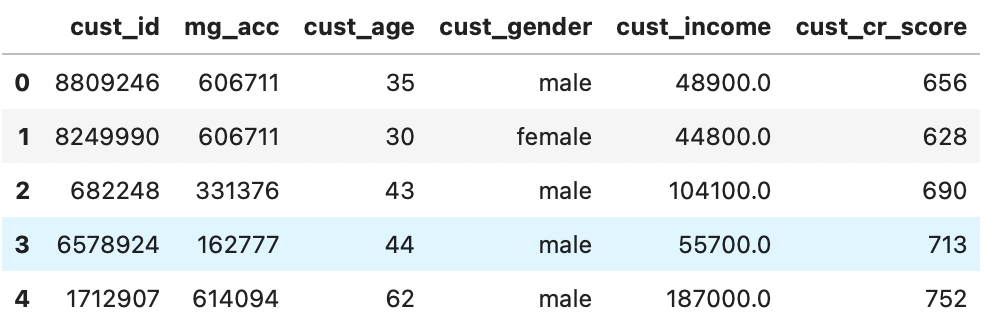
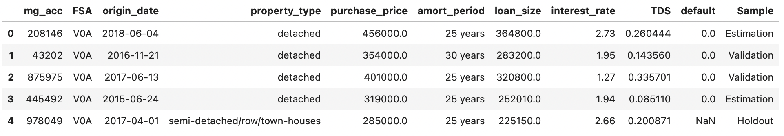
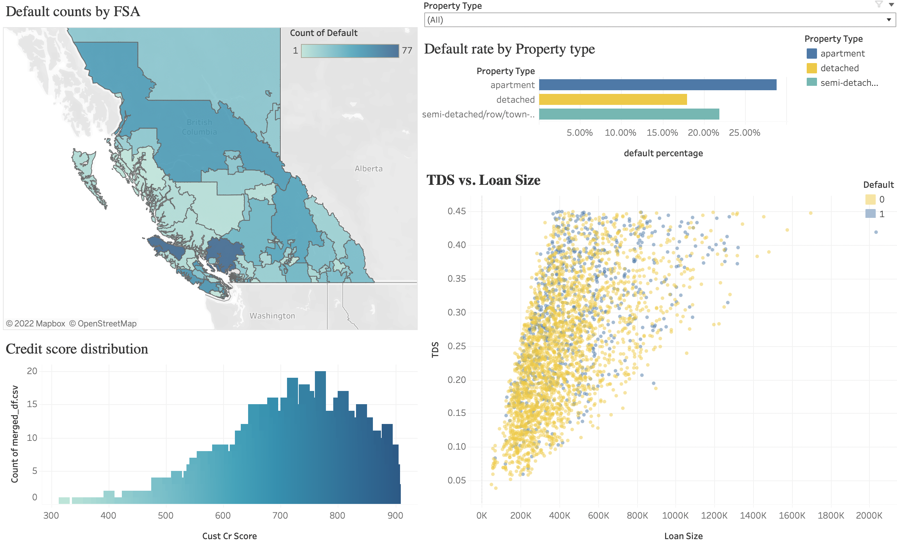

# SFU Beedie Business Analytics Hackathon 2020

Details of the competition can be found [here](https://beediehackathon.bus.sfu.ca/files/2020HackathonCase20201114.pdf).

## Background: 
In order to address the challenges with buying a home during the pandemic, Mortgage Direct (MD), a fintech startup is looking to offer mortgages exclusively online via their secure website requiring no in-person interactions at all. A customer can submit its mortgage application to MD and receive the approval decision with the mortgage rate offer within six hours. MD is backed and supported by a venture capital group called VC Partners. Specializing in fintech, VC Partners has developed the lending algorithm for MD to automate each mortgage approval decision.

A MD co-founder thinks it is time to launch MD and has decided to promote MD primarily via banner ads and Facebook/Instagram advertising. However, the co-founder does not know who they should target for those ads. VC Partners thus suggested the co-founder to take the mortgage default risk into such marketing consideration. For example, it may be a good idea to avoid applicants with high default risk in promotion so that the eventual approval decision would not disappoint too many customers and hence generate positive word-of-mouth.

## Objectives: 
**Objective 1:** build a model predicting mortgage default

**Objective 2:** identify the customer characteristics that are most associated with default. The insights will then be used to develop the acquisition strategies.

## Data after cleaning: 
**Customer dataset**:

**Mortgage dataset**:

## Approach:
1. Data Cleaning
    - Merging two datasets
    - Feature engineering
    - EDA
2. Data Modeling
    1. Process the data for modeling
        - Drop irrelevent features
        - One-hot encoding the categorical features
        - Scale the numerical feature values to a uniform range
    2. Machine learning models applied:
        - Logistics Regression
        - Random Forest Classifier
        - XGBoost Classifier
        - Support Vector Classifier
        - Ensemble Classifer
    3. Hyperparameter tunning
    4. Feature importance
3. Model evaluation
   - Plot and compare ROC Curve and Precision-Recall Curve for all the models
   - Choose logistic regression for submission (ROC score of logistic regression classifier: `0.65`)
4. Presentation slide can be found [here](https://docs.google.com/presentation/d/e/2PACX-1vTAwepeWr0ou0yx4GNQ9_ycLWh3qtcJbBIBxBGEjjvvMRRkALXtzIsGz1fE_y1CCsUQBZrQU99o3TJb/pub?start=false&loop=false&delayms=3000&slide=id.p12).
5. [Tableau Visualization](https://public.tableau.com/app/profile/ling.xiang.zou/viz/Mortgagedefaultvisualization/Dashboard1?publish=yes)
    - A representation of the map of the BC and the color gradient gives us the default counts for individual FSA.
    - Customers' credit score distribution
    - Default rate by property type
    - Scatter plot of TDS vs. Loan size
    
